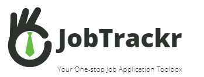
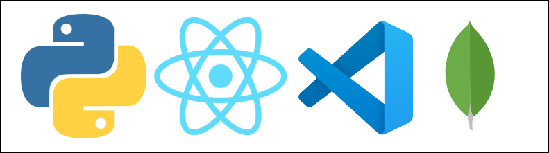
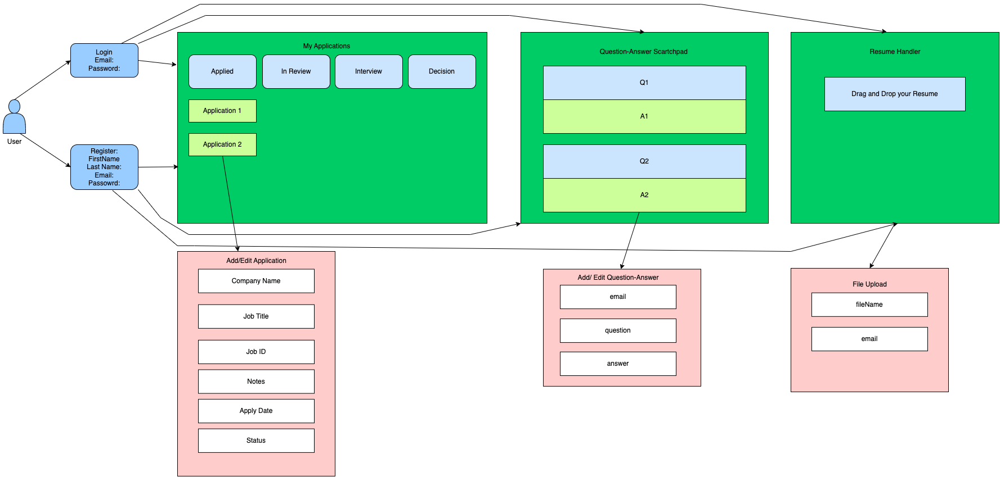
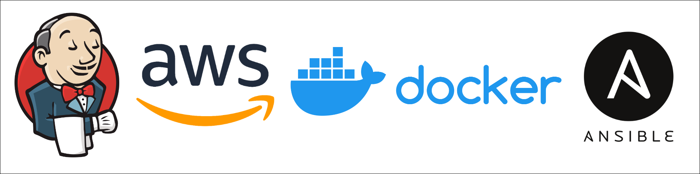
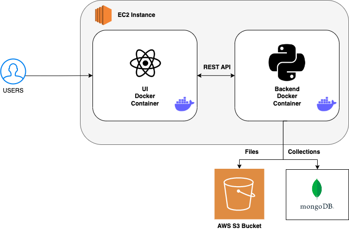
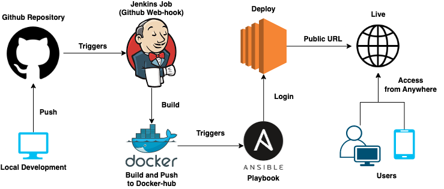

# JobTrackr Application

<p align="center">
  
</p>

[](https://zenodo.org/badge/latestdoi/543812642)


[](https://github.com/jayrajmulani/se-group1-project2/actions/workflows/frontend_build_test.yml)
[](https://github.com/jayrajmulani/se-group1-project2/actions/workflows/backend_build.yml)
[](https://github.com/jayrajmulani/se-group1-project2/actions/workflows/code_coverage.yml)

<!--  -->


[](https://github.com/jayrajmulani/se-group1-project2/releases/)
[](https://codecov.io/github/jayrajmulani/se-group1-project2)

---

## Yes, its live! Click [here](http://3.110.50.141:3000) to checkout JobTrakr!

### Documentation for the project is available [here](https://jayrajmulani.github.io/se-group1-project2/backend/index.html).

---

## Table of Contents

- [Description](#description)
- [What's New?](#whats-new)
- [Development Tech Stack](#development-tech-stack)
- [Deployment Tech Stack](#deployment-tech-stack)
- [Architecture](#architecture)
- [CI/CD Pipeline](#cicd-pipeline)
- [Application Demo](#application-demo)
- [Getting Started](#getting-started---user)
- [Development Specifications](#development-tech-stack)
  - [Backend](./backend/README-backend.md)
  - [Frontend](./ui/README-frontend.md)
- [Features Overview]()
- [License](./LICENSE)
- [Tools](#tools)
- [Contributors](#Contributors-👨‍🏭)

## Description

Excel sheets that are complex and disorganized must go! Every job-related data can be managed by our JobTrackr Application, including your job profile, applications, status, important dates, notes, saved applications, job descriptions, recruiter details, compensation and offer package, and more. Now, it supports even managing your files and offers a Question Answer Scrathpad for you to save answers to commonly asked questions during job applications.

## What's New?

https://user-images.githubusercontent.com/39649967/205716460-d45bbad7-6222-4a0d-9bb1-bbd808db53a2.mp4

## Development Tech Stack

<p align="center">

</p>

- `react 18.2.x`
- `babel 7.19.x`
- `webpack cli 4.x`
- `sass` (Dart Sass)
- `Python 3.8+`
- `Flask`
- `MongoDB`

Note: This repository is configured with [Dart-sass](https://github.com/sass/dart-sass) and not [Node Sass].

<!-- ## Basic Design

 -->

<!--
## Roadmap
 -->

## Deployment Tech Stack

<p align="center">

</p>

- `AWS`
- `Docker`
- `Jenkins`
- `Ansible`

## Architecture

<p align="center">
  </a>
</p>

## CI/CD Pipeline

<p align="center">
  </a>
</p>

## Application Demo

https://user-images.githubusercontent.com/30636208/194689139-29cdb217-a9e1-4fea-977d-74cbeb6d6799.mp4

## Getting Started - User

All you need to do is visit [here](http://3.110.50.141:3000)

## Getting Started - Developer

### Prerequisites

- npm 8.x (8.9 recommended)
- yarn 1.22.x
- Python 3.8+

### Installation

1. Clone the repository

```
git clone https://github.com/jayrajmulani/se-group1-project2.git
```

2. [Backend Setup](./backend/README-backend.md)
3. [UI Setup](./backend/README-backend.md)

## Tools

- Preetier Code Formatter
- PyLint with Flake8

## Third-Party Tools

- [MongoDB Cloud](https://www.mongodb.com/)

## Contributors 👨‍🏭

<table>
<tr>
    <td align="center"><a href="https://github.com/jayrajmulani"><br /><sub><b>Jayraj Mulani</b></sub></a></td>
    <td align="center"><a href="https://github.com/Yashasya"><br /><sub><b>Yashasya Shah</b></sub></a></td>
    <td align="center"><a href="https://github.com/Dhrumil0310"><br /><sub><b>Dhrumil Shah</b></sub></a></td>
    <td align="center"><a href="https://github.com/Harshil47"><br /><sub><b>Harshil Sanghavi</b></sub></a></td>
    <td align="center"><a href="https://github.com/anishasc99"><br /><sub><b>Anisha Chazhoor</b></sub></a></td>
</tr>
  <tr>
    <td align="center"><a href="https://github.com/rahulrk2303"><br /><sub><b>Rahul Rangarajan Kannan</b></sub></a></td>
    <td align="center"><a href="https://github.com/ekanshsinghal"><br /><sub><b>Ekansh Singhal</b></sub></a></td>
    <td align="center"><a href="https://github.com/gowtham-sathyan"><br /><sub><b>Gowtham Sathyan</b></sub></a></td>
    <td align="center"><a href="https://github.com/sbkrishna123"><br /><sub><b>Supriya Krishna</b></sub></a></td>
  </tr>
</table>

## License

Distributed under the MIT License. See `LICENSE` for more information.
